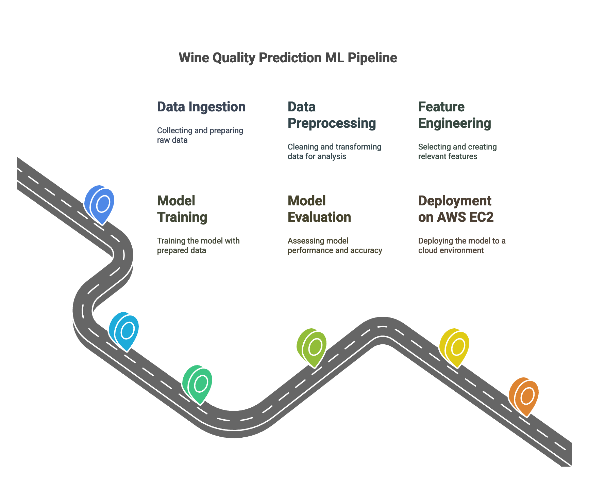

# End-to-end Machine Learning Project with MLflow

## Overview

This repository showcases an end-to-end machine learning project to predict wine quality based on physicochemical properties. It covers every stage of the ML lifecycle, from data ingestion to deployment on AWS EC2 using App Runner.



---

## How to Run?

### **Steps:**

1. **Create a Conda Environment:**

   ```bash
   conda create -n mlproj python=3.8 -y
   conda activate mlproj
   ```

2. **Install Dependencies:**

   ```bash
   pip install -r requirements.txt
   ```

3. **Run the Application:**

   ```bash
   python app.py
   ```

4. **Access Locally:**

   Open your local host and port to view the app.

---

## MLflow

[Official Documentation](https://mlflow.org/docs/latest/index.html)

### Commands:

- **Run MLflow UI**:  
  ```bash
  mlflow ui
  ```

### DAGsHub Integration:

To set up MLflow tracking on DAGsHub, use the following:

- Export environment variables:

  ```bash
  export MLFLOW_TRACKING_URI=https://dagshub.com/entbappy/End-to-end-Machine-Learning-Project-with-MLflow.mlflow
  export MLFLOW_TRACKING_USERNAME=entbappy
  export MLFLOW_TRACKING_PASSWORD=6824692c47a369aa6f9eac5b10041d5c8edbcef0
  ```

- Run your script:

  ```bash
  python script.py
  ```

---

## AWS CICD Deployment with GitHub Actions

### **Steps:**

1. **Login to AWS Console.**

2. **Create IAM User with Specific Access:**
   - **Access Policies Required:**
     - `AmazonEC2ContainerRegistryFullAccess`
     - `AmazonEC2FullAccess`

3. **Create ECR Repository:**
   - Save the URI:  
     `566373416292.dkr.ecr.ap-south-1.amazonaws.com/mlproj`

4. **Launch EC2 Machine (Ubuntu):**
   - **Install Docker on EC2:**  
     ```bash
     sudo apt-get update -y
     sudo apt-get upgrade -y
     curl -fsSL https://get.docker.com -o get-docker.sh
     sudo sh get-docker.sh
     sudo usermod -aG docker ubuntu
     newgrp docker
     ```

5. **Configure EC2 as Self-Hosted Runner:**
   - Go to `Settings > Actions > Runner > New Self-Hosted Runner`, and follow the instructions.

6. **Set Up GitHub Secrets:**
   - Add the following secrets in your GitHub repository:
     - `AWS_ACCESS_KEY_ID`
     - `AWS_SECRET_ACCESS_KEY`
     - `AWS_REGION` (e.g., `us-east-1`)
     - `AWS_ECR_LOGIN_URI` (e.g., `566373416292.dkr.ecr.ap-south-1.amazonaws.com`)
     - `ECR_REPOSITORY_NAME` (e.g., `mlproj`)

7. **Deploy Docker Image via ECR and EC2:**
   - Build the Docker image, push it to ECR, and launch it on EC2.

---

## About MLflow

- **Production-Grade Tool**: Tracks experiments and manages ML models.  
- **Features**:  
  - Experiment logging and visualization.  
  - Model versioning with tags for easy tracking.

